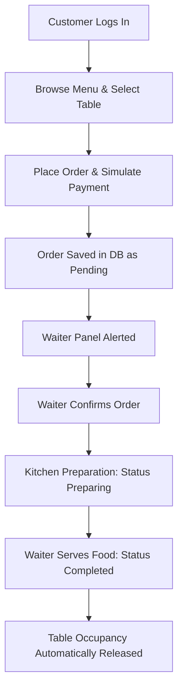

# 🍽️ Restaurant Management System (RMS)

[](#)
[](https://avaloniaui.net/)
[](https://sqlite.org/)
[](https://dotnet.microsoft.com/languages/csharp)

A comprehensive, desktop-based Restaurant Management System designed for modern dining operations. RMS connects **Customers**, **Waiters (Staff)**, and **Administrators** in a unified relational workflow to optimize seating occupancy, handle walk-in/online orders, enforce prepaid payment validation, and track waiter accountability.

Built using **C#**, **.NET 8**, **Avalonia UI**, and **SQLite**.

---

## 🌟 Key Features

### 👤 Self-Service Customer Portal
* **Visual Menu Browsing:** Styled product cards categorized dynamically with search functionality.
* **Smart Table Seating Selection:** Live seating status tracking. Tables filter dynamically according to seat capacities vs active customer order loads.
* **Cart & Payment Simulation:** Real-time quantity adjustments, cart totals, and online checkout simulator.

### 👤 Waiter & Staff Panel
* **Table Occupancy Grid:** Real-time visual monitoring of seating layouts.
* **Pre-paid Security Lock:** Locked Cash Payment validation for offline walk-in tables to prevent unpaid invoices.
* **Preparation Workflow Controls:** Advance orders through status lifecycles (`Pending` ➡️ `Confirmed` ➡️ `Preparing` ➡️ `Completed`).
* **Audit Tracking:** Automatic logging of waiter names on order confirmation and fulfillment.

### 👤 Central Administration Panel
* **Real-time Analytics:** Sales summary dashboard detailing revenue metrics and order volume logs.
* **Staff Credentials Control:** Management console to create, update, or remove Admin, Waiter, and Customer accounts.
* **Dishes & Menu Editor:** Full CRUD operations on recipes, prices, categories, and image URLs.
* **Historic Receipt Inspection:** Logs showing itemized receipts, including thumbnails or category-specific emojis.

---

## 🛠️ Technology Stack
* **UI Framework:** Avalonia UI (Cross-platform XAML-based framework)
* **Backend Runtime:** .NET 8.0 SDK
* **Database Engine:** SQLite (Embedded relational SQL engine)
* **Image Delivery:** Online URL Loader with asynchronous local disk caching (`UIHelper`)

---

## ⚙️ How to Setup & Run

### Prerequisites
Make sure you have the **.NET 8 SDK** installed on your system.

```bash
# Verify .NET SDK installation
dotnet --version
```

### Installation
1. Clone the repository:
   ```bash
   git clone https://github.com/ta-syn/Restaurant-Management-System-OOP2.git
   cd Restaurant-Management-System-OOP2
   ```

2. Restore NuGet dependencies:
   ```bash
   dotnet restore
   ```

3. Build the project:
   ```bash
   dotnet build
   ```

4. Run the application:
   ```bash
   dotnet run
   ```

---

## 🔑 Test Credentials
To simplify grading and testing, use the following pre-seeded database accounts:

| Username | Password | Role | Description |
| :--- | :--- | :--- | :--- |
| `admin` | `admin123` | **Admin** | Full system controls and sales stats |
| `waiter1` | `waiter123` | **Waiter** | Seating grid and order confirmations |
| `waiter2` | `waiter123` | **Waiter** | Seating grid and order confirmations |
| `customer1` | `customer123` | **Customer** | Menu browsing, table booking, ordering |

---

## 📐 System Flow Overview


